## GitHub Actions Project
Deploying food-delivery website using GitHub Actions in AWS S3 Bucket

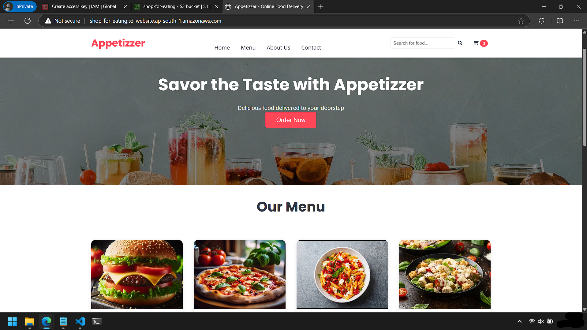

## Integrating GitHub and AWS
1. **Create an IAM User** -
    * **User name**: Give a name 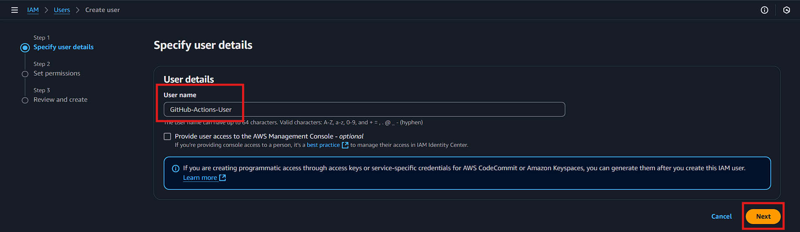
    * **Permissions options**: select `Attached policies directly`
    * **Permissions policies**: select `AdministratorAccess` policy 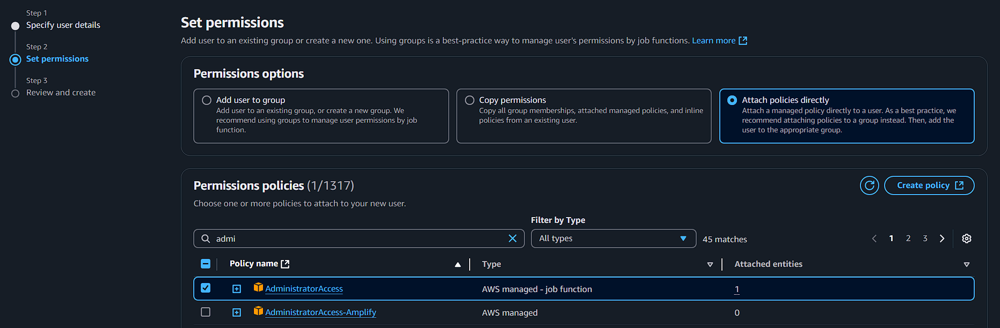
    * Create the user and click on `Security credentials` tab and then `Create access key` 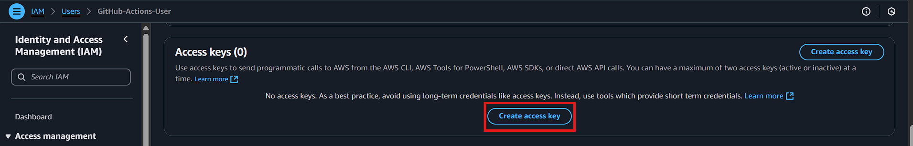
    * **Use case**: Select `Command Line Interface (CLI)` 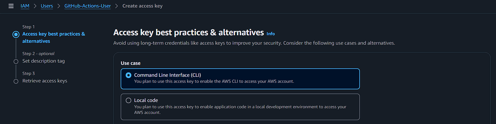
    * Create the access key and copy the `Access key` & `Secrete access key` credentials 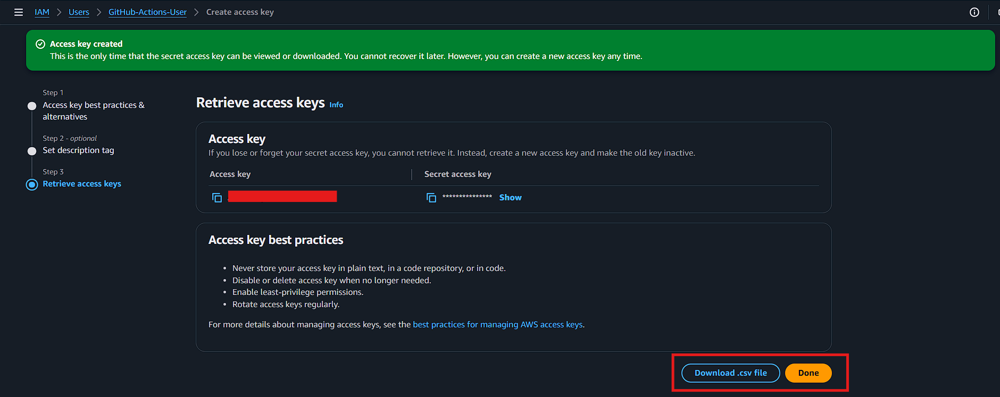

2. **Create a S3 Bucket**
    * **Bucket name**: give an unique name
    * **Object Ownership**: Select `ACLs disable (recommended)` 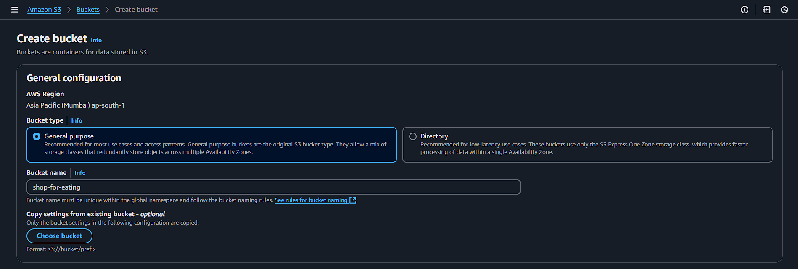
    * Uncheck `Block all public access` 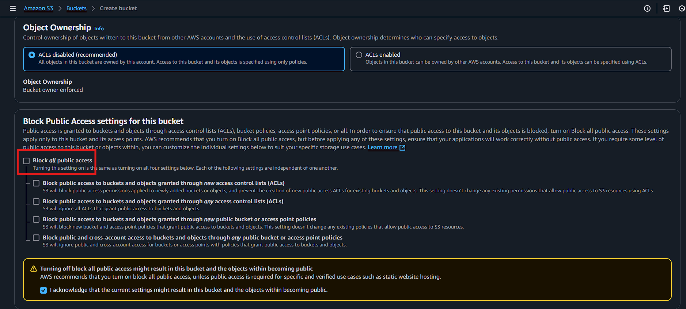
    * Create the Bucket
    * Click on **Properties** tab and `Enable` the **Static website hosting** of the newly created bucket 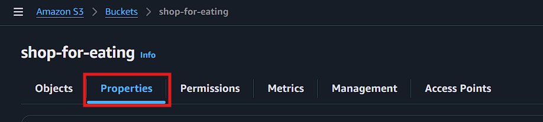 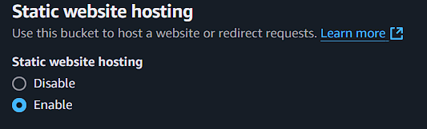
    * Click on **Permissions** tab and add the following policy **Bucket policy** 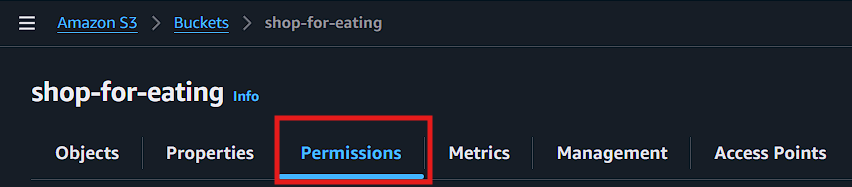 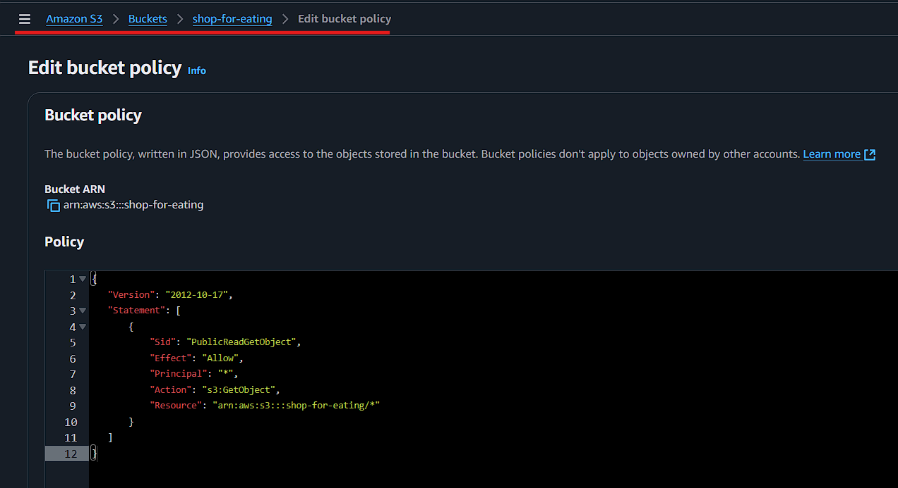
```JSON
{
   "Version": "2012-10-17",
   "Statement": [
       {
           "Sid": "PublicReadGetObject",
           "Effect": "Allow",
           "Principal": "*",
           "Action": "s3:GetObject",
           "Resource": "arn:aws:s3:::shop-for-eating/*"
       }
   ]
}
```

3. **Creating a GitHub Actions** -
* Fork the `Appetizzer_Website` repository and navigate to `.github/workflow/main.yml`
* Navigate to Repository `Settings` --> `Secretes and variables` --> `Actions` --> `New repository secrete` and add the `Access key` & `Secrete access key` credentials under **Repository secretes** 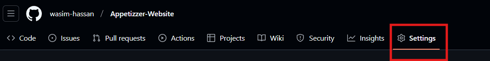 
    * **Name**: add the name of Access key & Secrete access key in `main.yml` file
    * **Secretes**: add the Access key & Secrete access key credentials from the `AWS` 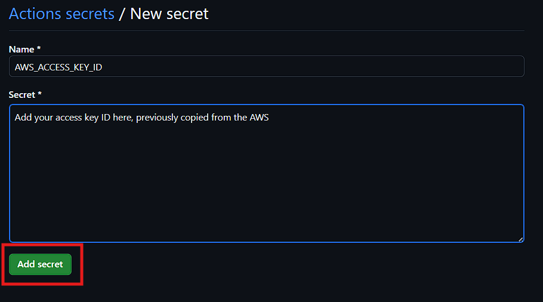 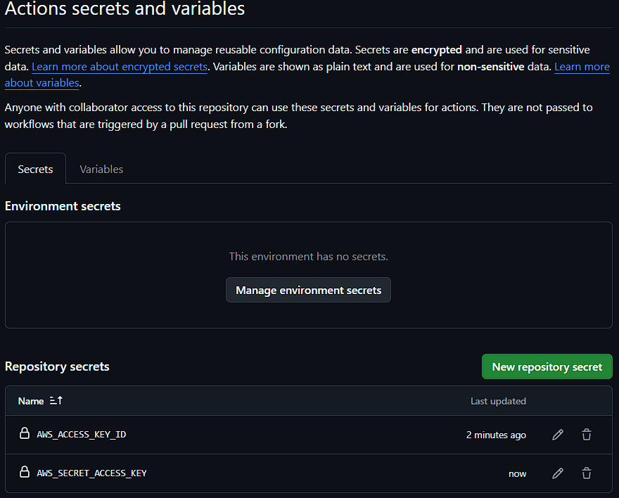
* Add your S3 Bucket name, AWS Region name in the [main.yml](.github/workflows/main.yml) file and `Commit changes`
* Click on `Actions` and you may view the changes 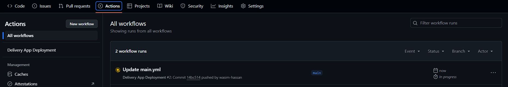 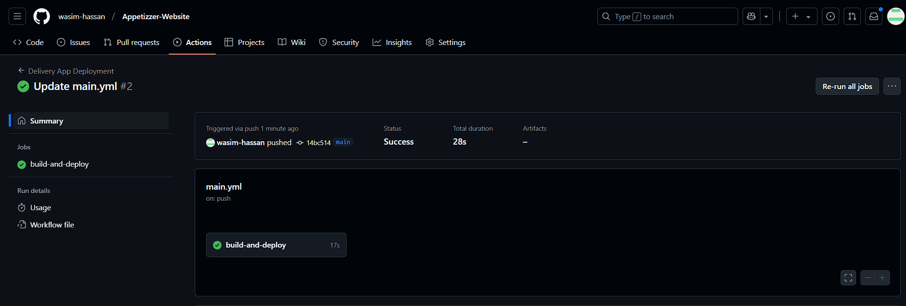

> Now you are all set and good to go

1. Click on the `Bucket website endpoint` under the **Static website hosting** and it will take you to your website 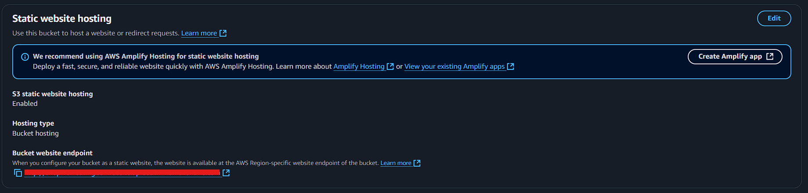
